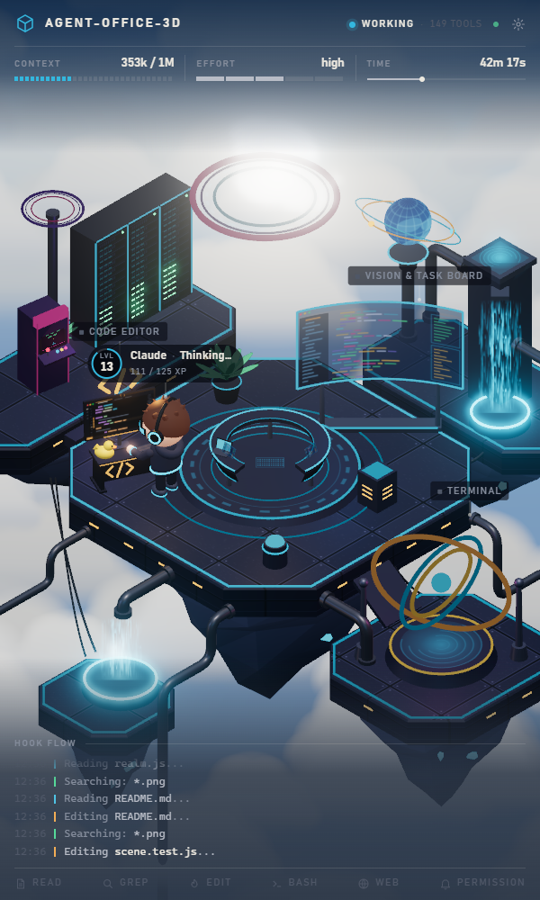
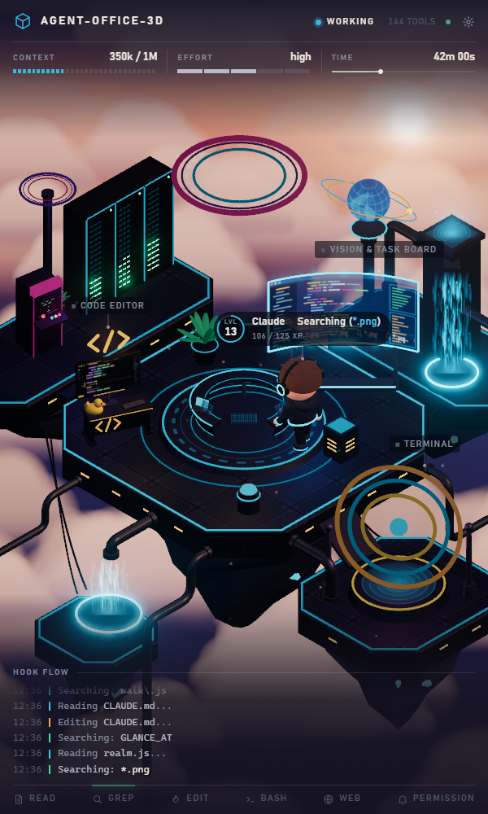
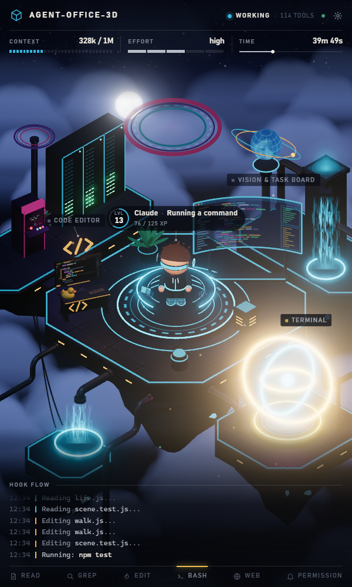

# agent-office-3d

A live 3D monitor for [Claude Code](https://code.claude.com). It runs in a narrow window next to your
editor and shows what the agent is doing right now: which tool it uses, which file it reads or
edits, when it waits for your permission, how full its context is and how long the session runs.

<p align="center">
  
  
  
</p>
<p align="center"><sub>Real moments from building this project. The sky follows your local time.</sub></p>

A small workshop floats above a sea of clouds. A character works at the station that matches the
current tool (and keeps busy there: it moves around the station, fidgets and glances at other busy
stations), and a station lights up only while it is in use:

| Station | Lights up for |
|---|---|
| Code Editor | Edit, Write |
| Vision & Task Board | Read, Grep, Glob, task lists |
| Terminal | Bash and PowerShell commands |
| Orbit Sphere | WebSearch, WebFetch |
| Portal Ring | subagents (a helper bot per running subagent) |
| Server Racks | context fill (LEDs) and compaction |
| Arcade | the agent plays here after a finished turn |

Waiting for permission turns the desk light yellow; an API error brings a storm. The HUD shows the
context size in tokens, the effort level, the session time, a log of hook events and a level that
grows with every finished tool call. Every number on screen comes from a real Claude Code hook event.

## Requirements

- Windows 10 or 11 (the hook uses Windows PowerShell 5.1, which comes with Windows)
- [Node.js](https://nodejs.org) 20 or newer (the LTS version is fine)
- [Claude Code](https://code.claude.com) (CLI, VS Code extension or desktop app)
- [Git](https://git-scm.com) to download the project (or "Download ZIP" on GitHub and unpack it)

## Install

Open PowerShell or Windows Terminal and run:

```powershell
git clone https://github.com/ozyusuf/agent-office-3d.git
cd agent-office-3d
powershell -ExecutionPolicy Bypass -File install.ps1
```

The installer:

1. checks Node.js and runs `npm install`;
2. shows the exact change it wants to make to your Claude Code user settings
   (`%USERPROFILE%\.claude\settings.json`) as a diff: one hook on 13 events, nothing else touched.
   It changes the file **only after you type `y`**, and saves a copy of the old file next to it
   first (`settings.json.agent-office-3d-<date>.bak`);
3. asks whether you want a desktop shortcut and whether the server should start when you log in;
4. offers to start the server and open the monitor.

Keep the project folder where it is: the hook runs from it. If you move it, run `install.ps1` again
from the new place. Running it twice is safe; it only adds what is missing.

## Use

- **Start:** the desktop shortcut, or `powershell -ExecutionPolicy Bypass -File scripts\start.ps1`,
  or `npm start` in the project folder (that one keeps a console window open).
  The monitor opens at http://127.0.0.1:7847 (in a narrow Edge app window when Edge is installed).
- **Work:** use Claude Code as usual, in any project. Put the monitor next to your editor; a window
  about 600 px wide works best.
- **Stop:** `powershell -ExecutionPolicy Bypass -File scripts\stop.ps1` (or Ctrl+C in the `npm start`
  window). When the server is not running the hook exits at once and Claude Code is not affected.
- **Settings:** the gear icon at the top right: agent name, title, language (English / Turkish),
  accent colour, sky (your clock, or a fixed dawn / day / dusk / night), 3D quality, context window.
  Changes apply at once in every open tab and are saved to `config.json`.
- **Port:** 7847 by default. To change it, put `"port": 7848` in `config.json` (see
  `config.example.json`) and restart the server; the hook reads the same file.
- **Raw events:** http://127.0.0.1:7847/debug.html shows every hook event as it arrives.

## Uninstall

```powershell
powershell -ExecutionPolicy Bypass -File uninstall.ps1
```

It shows the change and asks first. If your settings file has not changed since the install, it
puts back the exact copy saved before installing; otherwise it removes only agent-office-3d's
entries and keeps everything else. It also removes the shortcuts and can stop the server. Then you
can delete the folder.

## Privacy

Everything stays on your machine. The server listens on 127.0.0.1 only, checks the Host and Origin
headers, and never calls a model or any outside service. The hook sends each event's JSON to that
local server and nowhere else. The server keeps only small display values (tool name, file name,
search pattern, first line of a command, web host) and drops file contents and tool output. To show
the context size it reads the end of the session transcript that Claude Code names in each event
and keeps only the token count. The prompt is kept as a 120-character preview that only the debug
view shows. Your level (XP) is stored in `data/stats.json`.

## Troubleshooting

- **No events on screen.** Is the server running (http://127.0.0.1:7847/health)? Run
  `node scripts\setup.js status` to see whether the hook is in your settings. Hook changes reach
  running Claude Code sessions by themselves; if one does not react, restart it. If your settings
  contain `"disableAllHooks": true`, no hook runs.
- **"Waiting for permission" stays on after you deny a request.** Claude Code fires no hook when a
  permission is denied in its dialog, so the monitor learns about it only with the next event.
- **Port already in use.** Another program uses 7847: set another `port` in `config.json`.
- **The shortcut shows a message instead of the monitor.** The message says why (Node.js missing,
  packages missing, port taken); the server's own output is in `data\server.log`. If you moved the
  folder, run `install.ps1` again so the shortcuts point at the new place.
- **The installer stops because the settings file is not valid JSON.** Fix the file (or restore
  one of its backups) and run the installer again; nothing was changed.

## Other platforms

The hook script and the installer are Windows-only for now. The server and the page are plain
Node.js and would run anywhere; a macOS or Linux port needs a hook that posts the event's stdin to
`http://127.0.0.1:7847/event` with the header `X-Agent-Office: 1` (and optionally the hook's start
time in milliseconds as `X-Hook-Ts`), never prints anything and always exits 0, for example with
`curl`. Contributions are welcome.

## Development

```
npm install
npm start      # server on http://127.0.0.1:7847
npm test       # unit tests (node:test)
```

Inside this folder Claude Code also runs the hook from the project's `.claude/settings.json`; with
the user-level hook installed too, the server drops the second copy of each event. Plain ES modules,
no build step; three.js is served from `node_modules`. Start with [CLAUDE.md](CLAUDE.md) and the
documents in [docs/](docs/): the plan, the design, every decision with its reason, and
[how it was built](docs/HOW-IT-WAS-BUILT.md).

## License

[MIT](LICENSE)
